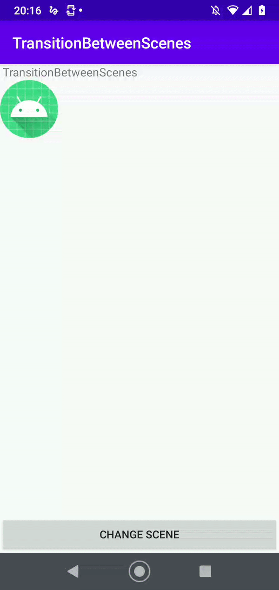

This is a simple example usage of TransitionManager with scenes created from layout files.
This solution is a alternative to the animation based on ConstraintSet which has some limitations like no getting all different in attributes between widgets from layouts.
However, according the documentation, TransitionManager has also some limitations that should be considered before you implement solution in your project. 
  
To the read more please read official documentation.  https://developer.android.com/training/transitions

 

